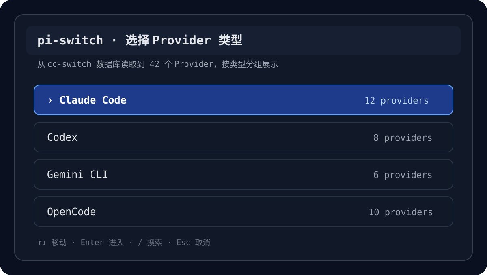
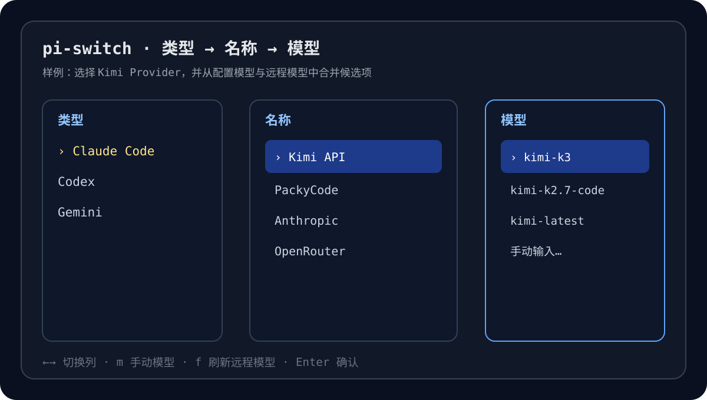
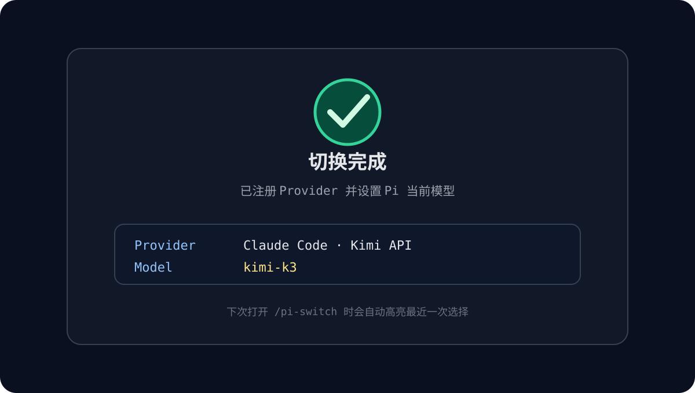

# pi-switch

English | [中文](./README-zh.md)

pi-switch is a Pi extension package built on top of [cc-switch](https://github.com/farion1231/cc-switch). It uses cc-switch as the source of provider and model configuration, then exposes a fast provider/model switcher directly inside Pi.

pi-switch does not replace cc-switch and does not modify the cc-switch database. It reads the local cc-switch SQLite database in read-only mode, registers the selected provider in Pi, and stores the active model in Pi settings.

## Preview

The screenshots below are examples that demonstrate the interaction flow. Actual providers, models, and paths depend on your local cc-switch data.

## Features

- Open the interactive switcher in Pi with /pi-switch or /ccs.
- Load provider configuration from the local cc-switch SQLite database in read-only mode.
- Use a progressive three-level picker: provider type, provider name, then model.
- Search, paginate, manually enter model IDs, and refresh remote model lists.
- Parse and map common API protocols: Anthropic Messages, OpenAI Responses, OpenAI Chat Completions, and Google Generative AI.
- Merge allowlisted header rules such as anthropic-version and anthropic-beta.
- Persist the latest selection so the next switcher session can highlight and reuse it.

See [SPEC.md](./SPEC.md) for the full product contract.

## Built on cc-switch

cc-switch is the upstream configuration manager. pi-switch depends on the local cc-switch data model and treats cc-switch as the source of truth for providers.

pi-switch is intentionally scoped as a Pi-side bridge:

- cc-switch owns provider creation, editing, deletion, and storage.
- pi-switch reads cc-switch providers from ~/.cc-switch/cc-switch.db.
- pi-switch normalizes provider settings into Pi-compatible provider registrations.
- pi-switch switches the active Pi model without changing cc-switch state.

This means you should configure providers in cc-switch first, then use pi-switch to select and activate them inside Pi.

## Architecture

~~~text
┌──────────────────────┐
│      cc-switch       │
│ provider management  │
└──────────┬───────────┘
           │ read-only SQLite
           ▼
┌──────────────────────┐
│      pi-switch       │
│ DB read + normalize  │
└──────────┬───────────┘
           │ parsed providers
           ▼
┌──────────────────────┐
│   interactive picker │
│ type → name → model  │
└──────────┬───────────┘
           │ selected provider/model
           ▼
┌──────────────────────┐
│          Pi          │
│ register + setModel  │
└──────────────────────┘
~~~

Main modules:

~~~text
pi-switch/
├─ extensions/
│  └─ index.ts              # Pi extension entry; registers /pi-switch and /ccs
├─ src/
│  ├─ db.ts                 # Read the cc-switch SQLite database
│  ├─ register.ts           # Build and register Pi providers
│  ├─ settings.ts           # Pi settings I/O and migration
│  ├─ sqlite-path.ts        # sqlite3 executable resolution
│  ├─ models-fetch.ts       # Remote model discovery and merging
│  ├─ headers/              # Header rule loading and merging
│  ├─ parse/                # cc-switch provider config parsers
│  └─ ui/                   # Picker, pagination, labels, and tabs
├─ defaults/
│  └─ headers.json          # Default header rules
├─ docs/
│  └─ images/               # README sample screenshots
├─ tests/                   # Bun tests
├─ SPEC.md                  # Product spec
├─ DESIGN.md                # UI and interaction design notes
└─ package.json
~~~

## Installation

Install from npm:

~~~bash
pi install npm:pi-switch
~~~

Or install from GitHub:

~~~bash
pi install git:github.com/Bandersnatch0x/pi-switch
~~~

Update and enable the extension:

~~~bash
pi update npm:pi-switch
pi config
~~~

Pi packages usually land under ~/.pi/agent/npm/. With project-local installation, they are placed under .pi/npm/ in the current project.

## Usage

In a Pi session, run:

~~~text
/pi-switch
~~~

Or use the alias:

~~~text
/ccs
~~~

Typical flow:

1. Choose a provider type, such as Claude Code, Codex, Gemini, or OpenCode.
2. Choose a specific provider.
3. Choose a model, or manually enter a model ID.
4. pi-switch registers the provider and switches the current Pi model.

After selection, Pi uses the selected provider baseUrl, apiKey, protocol type, and model ID for subsequent requests.

## Requirements

- Pi is installed and extension packages are enabled.
- cc-switch is installed and configured.
- The local cc-switch database exists.
- sqlite3 is available on the system.

Default database path:

~~~text
~/.cc-switch/cc-switch.db
~~~

sqlite3 resolution order:

~~~text
SQLITE3_PATH → ~/.pi/agent/pi-switch.json sqlitePath → sqlite3 from PATH
~~~

Windows users should explicitly configure SQLITE3_PATH if sqlite3.exe is not globally available.

## Configuration

Optional configuration file:

~~~text
~/.pi/agent/pi-switch.json
~~~

Example:

~~~json
{
  "dbPath": "C:/Users/you/.cc-switch/cc-switch.db",
  "sqlitePath": "C:/tools/sqlite3.exe",
  "preferredOrder": ["claude-code", "codex", "gemini", "opencode"],
  "debug": false
}
~~~

| Field | Description |
| --- | --- |
| dbPath | Overrides the cc-switch database path |
| sqlitePath | Overrides the sqlite3 executable path |
| preferredOrder | Preferred provider type ordering in the UI |
| debug | Enables debug output |

The latest selection is stored as piSwitchSelection in Pi settings, so it can be highlighted the next time the switcher opens.

## Header Rules

Default header rules are stored at:

~~~text
defaults/headers.json
~~~

Optional user override file:

~~~text
~/.pi/agent/provider-headers.json
~~~

pi-switch only merges allowlisted headers to avoid injecting arbitrary sensitive fields into provider configuration. The current allowlist includes:

- anthropic-version
- anthropic-beta

Rule precedence follows the project spec: user rules override default rules, and explicit selection-time overrides have the highest priority.

## Development

Install dependencies:

~~~bash
bun install
~~~

Run tests:

~~~bash
bun test
~~~

Typecheck:

~~~bash
bun run typecheck
~~~

Pre-publish check:

~~~bash
bun run prepublishOnly
~~~

## Supported Configuration Sources

pi-switch parses provider configuration from the cc-switch providers table and normalizes it into Pi-registerable providers where possible.

- Claude / Claude Code config parsing
- Codex config parsing
- Gemini config parsing
- Grok Build config parsing
- OpenCode config parsing
- Hermes config parsing
- Generic / OpenAI-compatible config parsing

If a provider protocol cannot be mapped to a Pi-supported API type, it is shown as non-switchable in the UI instead of being force-registered.

## Out of Scope

- Does not edit the cc-switch database.
- Does not add, delete, reorder, or migrate providers.
- Does not include an API key manager.
- Does not track quota or cost.
- Does not replace cc-switch; it only acts as a switcher entry inside Pi.

## License

[MIT](./LICENSE)
